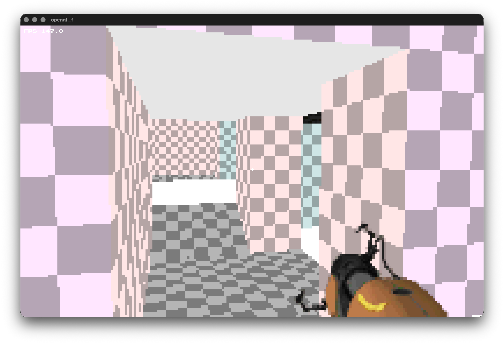
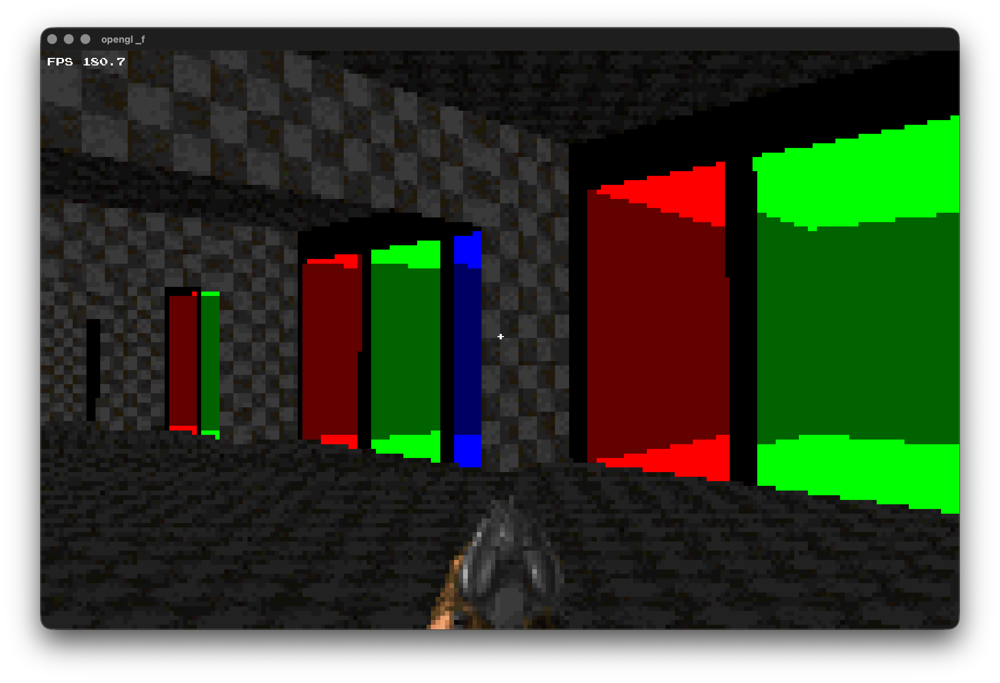
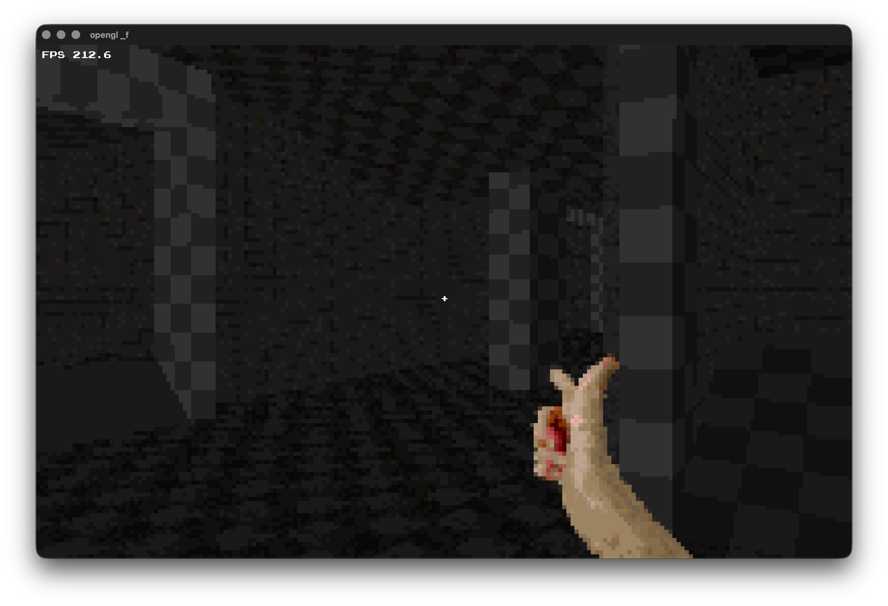

#### BGE - Basic Game Engine (cool name right)
- last showcase of engine:`https://youtu.be/8IT8n9sierU?si=2kPJQaqm_F3vs9J3`


#### THIS IS IT:








#### NOTES:
- Please dont clone everything and just do: `git clone --depth 1 https://github.com/xt9y/BGE.git`
- Linux build requirements : OpenGL loader/headers, X11
    - Example (Arch btw): `sudo pacman -S libx11 libxrandr libxi libxcursor libxinerama xorgproto mesa mesa-utils libglvnd`

#### C build system

Build and run this branch with [xt9y/C](https://github.com/xt9y/C-BuildSystem):

```sh
c build run
```

#### RendererCheck integration

With [xt9y/RendererCheck](https://github.com/xt9y/RendererCheck) installed:

```sh
rendercheck run
```
